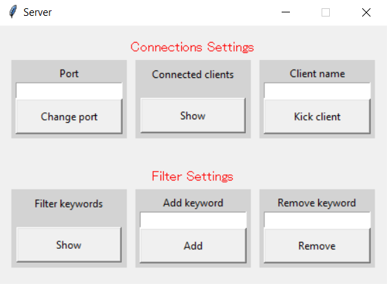
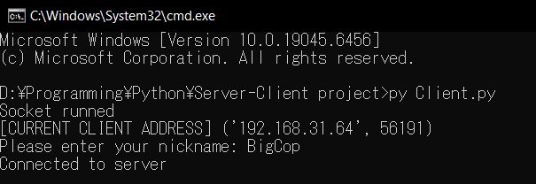
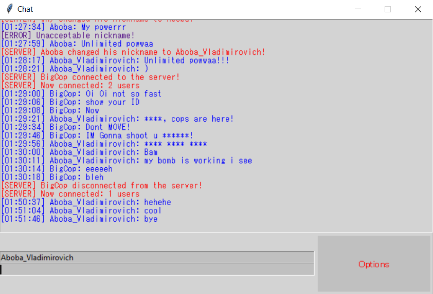

# 💬 GUI Client-Server Messenger

## 📌 About
This project implements a GUI-based client-server messenger application, focusing on real-time communication, socket programming, and user interface design.

## 🖼️ Screenshots

### Server Window 


### Client Joinging


### Main Chat Window


## ✨ Features
- 🔗 Client-server architecture
- 💬 Real-time messaging
- 🖥️ Graphical user interface (GUI)
- 👥 Multiple client support
- 📡 Socket-based communication
- ⚙️ Server admin panel
- 📜 Chat log 

## ⚙️ Technologies Used
- Programming Language: Python
- Networking: Sockets
- GUI: Tkinter

## 🚀 How to Run

### 1. Clone the repository
```bash
git clone https://github.com/your-username/your-repo.git
```

### 2. Start the server
```bash
py Server.py
```

### 3. Start the client
```bash
py Client.py
```